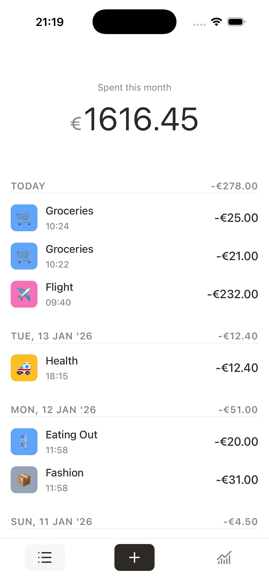
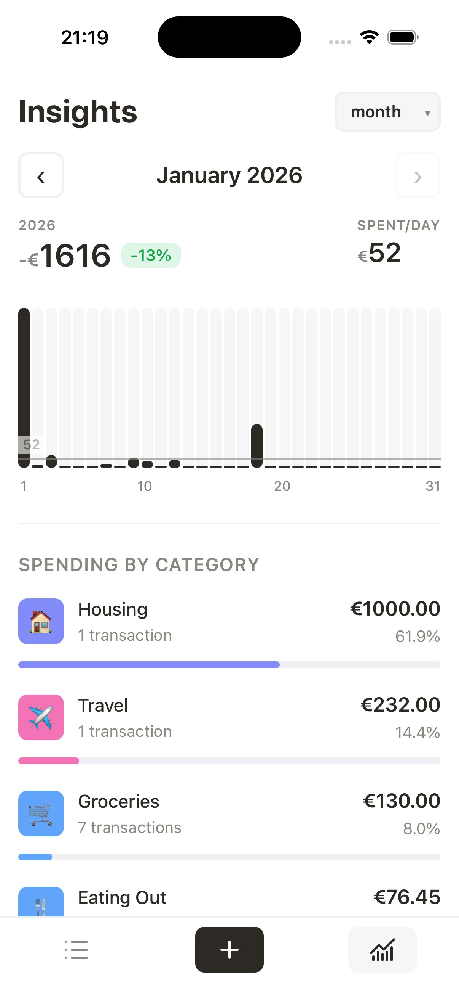

<div align="center">

# 💸 Expense Tracker

**A beautiful, mobile-first expense tracking app**

Built with Go + HTMX for lightning-fast performance

[](https://go.dev)
[](https://htmx.org)
[](https://sqlite.org)
[](LICENSE)

</div>

---

## ✨ Screenshots

<div align="center">
<table>
<tr>
<td align="center">

<br/>
<sub><b>Expense Feed</b></sub>
</td>
<td align="center">

<br/>
<sub><b>Monthly Insights</b></sub>
</td>
<td align="center">

<br/>
<sub><b>Quick Entry</b></sub>
</td>
</tr>
</table>
</div>

---

## 🎯 Features

| | Feature | Description |
|:---:|:---|:---|
| 📱 | **Mobile-First** | Designed for on-the-go expense tracking |
| ⚡ | **Instant Response** | Server-side rendering with HTMX — no JavaScript frameworks |
| 🔢 | **Quick Entry** | Specialized numpad for rapid expense logging |
| 📅 | **Smart Grouping** | Expenses organized chronologically by day |
| 📊 | **Visual Insights** | Monthly charts & category breakdowns |
| 🏷️ | **Categories** | Organize spending by type with emoji icons |
| 🔒 | **Secure** | User authentication with session management |
| 🐳 | **Containerized** | One-command deployment with Docker |

---

## 🚀 Quick Start

### Using Docker (Recommended)

```bash
docker-compose up --build
```

Open [http://localhost:8080](http://localhost:8080) and start tracking!

### Running Locally

```bash
# Install dependencies
go mod download

# Start the server
go run ./cmd/server

# Visit http://localhost:8080
```

---

## ⚙️ Configuration

| Variable | Description | Default |
|:---------|:------------|:--------|
| `PORT` | Server port | `8080` |
| `DB_PATH` | SQLite database path | `expenses.db` |
| `SECURE_COOKIE` | Enable secure cookies (HTTPS) | `false` |
| `ADMIN_USER` | Initial admin username | `admin` |
| `ADMIN_PASSWORD` | Initial admin password | *Random* |

> **Note:** On first run without users, the app creates an admin account. If `ADMIN_PASSWORD` is not set, a random password is printed to the logs.

---

## 📁 Project Structure

```
expense-tracker/
├── cmd/
│   ├── adduser/          # User management CLI
│   └── server/           # Application entry point
├── e2e/                  # End-to-end tests (Playwright)
├── internal/
│   ├── auth/             # Authentication logic
│   ├── handlers/         # HTTP request handlers
│   ├── models/           # Data models
│   └── storage/          # SQLite database layer
├── web/
│   ├── static/           # CSS, JS, icons
│   └── templates/        # HTML templates
└── docker-compose.yml    # Container orchestration
```

---

## 👤 User Management

### Add a User via CLI

```bash
go run ./cmd/adduser -user <username> -password <password>

# With custom database path
go run ./cmd/adduser -user <username> -password <password> -db path/to/expenses.db
```

---

## 🧪 Testing

### Unit Tests

```bash
go test ./internal/...
```

### E2E Tests

```bash
# Install Playwright browsers (first time)
go run github.com/playwright-community/playwright-go/cmd/playwright install --with-deps

# Run E2E tests
go test -v ./e2e/...
```

---

## 🛠️ Tech Stack

<table>
<tr>
<td align="center" width="100">

<br/><sub><b>Go</b></sub>
</td>
<td align="center" width="100">

<br/><sub><b>HTMX</b></sub>
</td>
<td align="center" width="100">

<br/><sub><b>SQLite</b></sub>
</td>
<td align="center" width="100">

<br/><sub><b>Playwright</b></sub>
</td>
</tr>
</table>

- **Backend:** Go with `html/template`
- **Database:** SQLite via [modernc.org/sqlite](https://modernc.org/sqlite) (CGo-free)
- **Frontend:** HTMX + Custom CSS
- **Testing:** Playwright for Go

---

## 📄 License

MIT License — feel free to use this for your own expense tracking!

---

<div align="center">

**[⬆ Back to Top](#-expense-tracker)**

</div>
