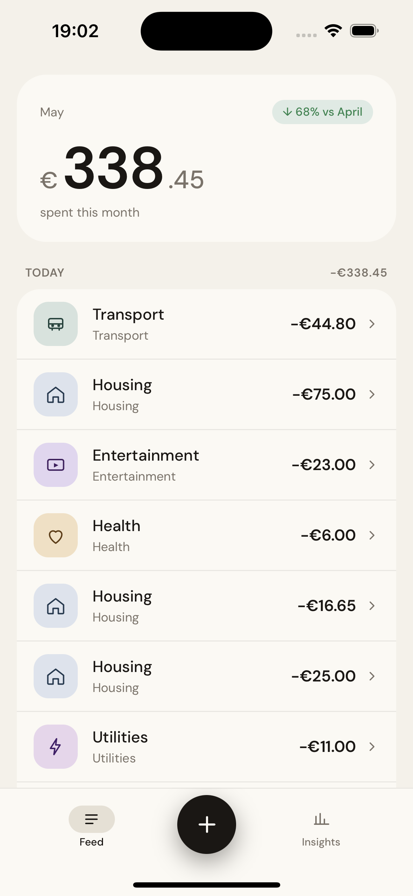
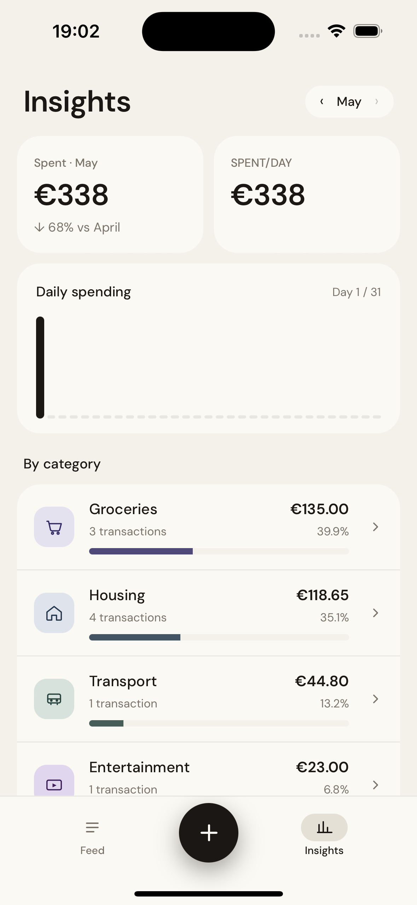
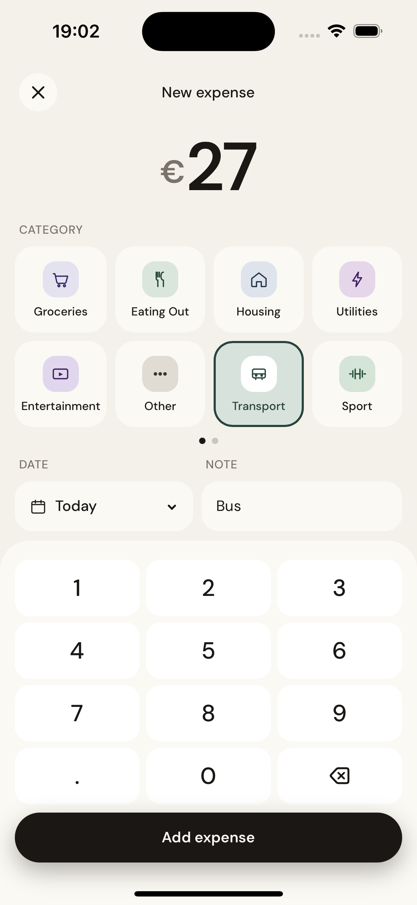

<div align="center">

# 💸 Expense Tracker

**A beautiful, mobile-first expense tracking app**

Built with Go + a React PWA, in the Linen & Ink visual style

[](https://go.dev)
[](https://react.dev)
[](https://vitejs.dev)
[](https://www.typescriptlang.org)
[](https://web.dev/progressive-web-apps/)
[](https://sqlite.org)
[](LICENSE)

</div>

---

## ✨ Screenshots

<div align="center">
<table>
<tr>
<td align="center">

<br/>
<sub><b>Expense Feed</b></sub>
</td>
<td align="center">

<br/>
<sub><b>Monthly Insights</b></sub>
</td>
<td align="center">

<br/>
<sub><b>Quick Entry</b></sub>
</td>
</tr>
</table>
</div>

---

## 🎯 Features

| | Feature | Description |
|:---:|:---|:---|
| 📱 | **Mobile-First** | Designed for on-the-go expense tracking |
| 🌐 | **Offline-First** | IndexedDB write queue + service worker; expenses you add offline sync when you're back online |
| 📲 | **Installable PWA** | Linen-stripes icon, standalone display, works from your home screen |
| 🎨 | **Linen & Ink Design** | Calm, paper-textured visual language — see [mockups/](mockups/) |
| 🔢 | **Quick Entry** | Specialized numpad for rapid expense logging |
| 📅 | **Smart Grouping** | Expenses organized chronologically by day |
| 📊 | **Visual Insights** | Monthly charts & category breakdowns |
| 🔒 | **Secure** | User authentication with session management |
| 🐳 | **Containerized** | One-command deployment with Docker |

---

## 🚀 Quick Start

### Using Docker (Recommended)

```bash
docker-compose up --build
```

The Docker build runs the React bundle build automatically. Open
[http://localhost:8080](http://localhost:8080) and start tracking!

### Local development

Two terminals — Go API on `:8080`, Vite dev server on `:5173` proxying `/api`
to Go:

```bash
# Terminal 1 — Go API
go run ./cmd/server

# Terminal 2 — React dev server
cd web/app && npm install && npm run dev
```

Visit [http://localhost:5173](http://localhost:5173) for the dev experience
with hot reload.

### Production build

Build the React bundle into `web/dist/` (which is embedded into the Go
binary), then build the binary:

```bash
cd web/app && npm run build
go build -o expense-tracker ./cmd/server
./expense-tracker
```

---

## ⚙️ Configuration

| Variable         | Description                   | Default       |
|:-----------------|:------------------------------|:--------------|
| `PORT`           | Server port                   | `8080`        |
| `DB_PATH`        | SQLite database path          | `expenses.db` |
| `SECURE_COOKIE`  | Enable secure cookies (HTTPS) | `false`       |
| `ADMIN_USER`     | Initial admin username        | `admin`       |
| `ADMIN_PASSWORD` | Initial admin password        | *Random*      |

> **Note:** On first run without users, the app creates an admin account. If `ADMIN_PASSWORD` is not set, a random password is printed to the logs.

---

## 📁 Project Structure

```
expense-tracker/
├── cmd/
│   ├── adduser/          # User management CLI
│   └── server/           # Application entry point (embeds web/dist)
├── e2e/                  # End-to-end tests (Playwright — needs update for the React DOM)
├── internal/
│   ├── api/              # JSON API handlers (auth, expenses, categories, insights)
│   ├── auth/             # Authentication & session middleware
│   ├── categories/       # Canonical category list (label + slug)
│   ├── insights/         # Pure stats/rollup logic
│   ├── models/           # Data models
│   └── storage/          # SQLite database layer
├── mockups/              # Linen & Ink design mockups (reference)
├── web/
│   ├── app/              # Vite + React + TypeScript PWA source
│   └── dist/             # Built bundle (gitignored, embedded by Go)
└── docker-compose.yml    # Container orchestration
```

---

## 👤 User Management

### Add a User via CLI

```bash
go run ./cmd/adduser -user <username> -password <password>

# With custom database path
go run ./cmd/adduser -user <username> -password <password> -db path/to/expenses.db
```

---

## 🧪 Testing

### Go tests

```bash
go test ./internal/...
```

### Frontend typecheck & build

```bash
cd web/app
npx tsc --noEmit
npm run build
```

### E2E Tests

```bash
# Install the Playwright driver + browsers (first time only).
# The version MUST match playwright-go in go.mod, otherwise you'll see
# "please install the driver (vX.Y.Z) first" at test startup.
go install github.com/playwright-community/playwright-go/cmd/playwright@v0.5200.1
playwright install            # add --with-deps on Linux to also install OS packages

# Run E2E tests (the harness builds web/dist on first run)
go test -v ./e2e/...
```

> The suite drives the React UI via Playwright and anchors on `data-testid`
> attributes the components expose for tests. The harness builds the React
> bundle into `web/dist` automatically when it's missing or still the
> placeholder, so the first run takes longer than subsequent ones.

---

## 🛠️ Tech Stack

<table>
<tr>
<td align="center" width="100">

<br/><sub><b>Go</b></sub>
</td>
<td align="center" width="100">

<br/><sub><b>React</b></sub>
</td>
<td align="center" width="100">

<br/><sub><b>Vite</b></sub>
</td>
<td align="center" width="100">

<br/><sub><b>SQLite</b></sub>
</td>
<td align="center" width="100">

<br/><sub><b>Playwright</b></sub>
</td>
</tr>
</table>

- **Backend:** Go JSON API (`internal/api`) with embedded `web/dist/` bundle
- **Database:** SQLite via [modernc.org/sqlite](https://modernc.org/sqlite) (CGo-free)
- **Frontend:** React + Vite + TypeScript
- **Data fetching:** [TanStack Query](https://tanstack.com/query) (React Query)
- **PWA:** [vite-plugin-pwa](https://vite-pwa-org.netlify.app/) + [Workbox](https://developer.chrome.com/docs/workbox) runtime caching
- **Offline writes:** [IndexedDB](https://developer.mozilla.org/en-US/docs/Web/API/IndexedDB_API) write queue (via [`idb`](https://github.com/jakearchibald/idb))
- **Testing:** Playwright for Go

---

## 📄 License

MIT License — feel free to use this for your own expense tracking!

---

<div align="center">

**[⬆ Back to Top](#-expense-tracker)**

</div>
